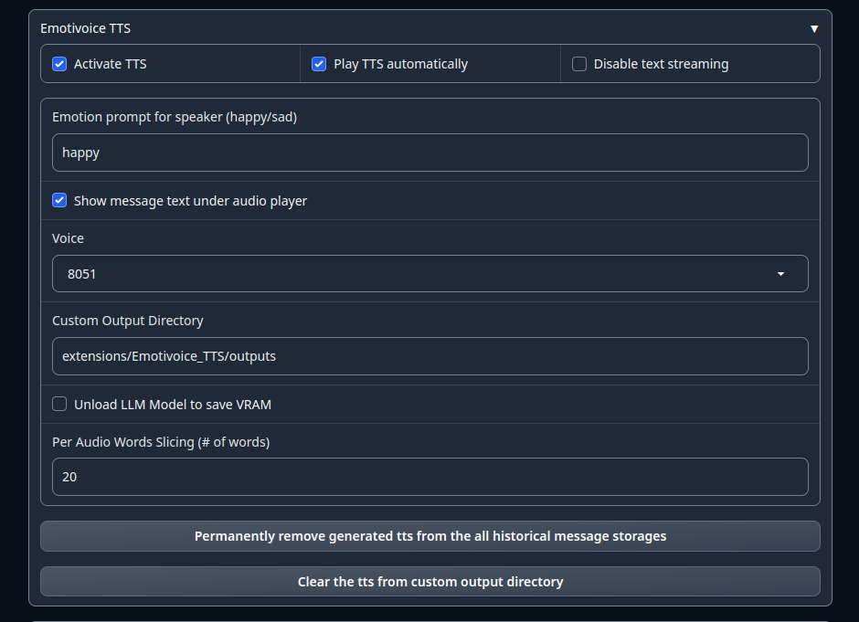

# Install instructions

Assume you are in the root directory of the text-generation-webui

```
cd ./extensions
git clone --depth 1 --recursive https://github.com/okazaki10/Emotivoice_RVC_TTS.git

cd ./Emotivoice_TTS
pip install -r requirements.txt

cd ./EmotiVoice
git lfs pull
pip install -r requirements.txt
git lfs clone --depth 1 https://huggingface.co/WangZeJun/simbert-base-chinese WangZeJun/simbert-base-chinese
rm -rf outputs
git lfs clone --depth 1 https://www.modelscope.cn/syq163/outputs.git

cd ./rvc_gui
git lfs pull
git lfs clone --depth 1 https://huggingface.co/kindahex/voice-conversion/blob/main/hubert_base.pt

cd ../../../
python sever.py --extensions EmotiVoice_RVC_TTS
```

and then put your rvc model in Emotivoice_TTS/rvc_gui/models

# Samlpes


<audio controls>
  <source src="./assets/test_1702656939.wav" type="audio/mpeg">
  Your browser does not support the audio element.
</audio>

<audio controls>
  <source src="./assets/test_1702657710.wav" type="audio/mpeg">
  Your browser does not support the audio element.
</audio>

# Screenshots



